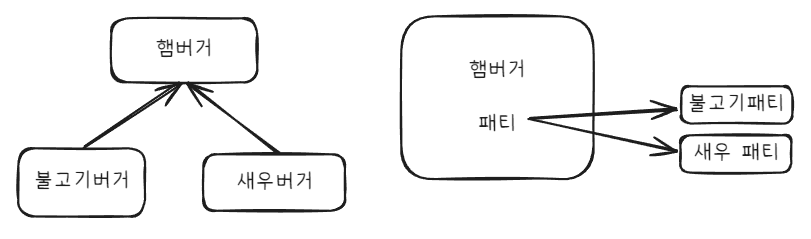

# 상속과 컴포지션


## 상속

### 구현 방법
상속은 extends를 통해 Child 클래스를 Parent 클래스로부터 파생시킨다.

### 특징
- 부모 클래스와 자식 클래스 사이의 의존성은 컴파일 타임에 해결
  - 런타임에 동적으로 변경 불가능
- 부모 클래스의 구현에 의존 결합도가 높음
  - 부모 클래스에서 기능 구현을 변경한다면, 하위 클래스가 모두 영향을 받는다.


## 컴포지션

### 구현 방법
컴포지션은 클래스를 구성하는 부분의 합으로 정의한다.

```java
public class Hamburger {
    public Meat meat; // 패티(Meat)는 햄버거를 구성하는 부분
}

// Meat는 인터페이스, Hamburger는 인터페이스를 의존한다.
public interface Meat {
    public String getMeat();
}

public class 불고기패티 implements Meat{
    @Override
    public String getMeat() {
        return "불고기 패티";
    }
}

public class 새우패티 implements Meat {
    @Override
    public String getMeat() {
        return "새우 패티";
    }
}
```

```java
Hamburger hamburger = new Hamburger();
hamburger.meat = new 불고기패티(); // 런타임에 객체 결정

Hamburger hamburger2 = new Hamburger();
hamburger.meat = new 새우패티();
```

### 특징
- 객체 사이의 의존성은 런타임에 해결
- 구현에 의존하는 것이 아닌, 인터페이스에 의존