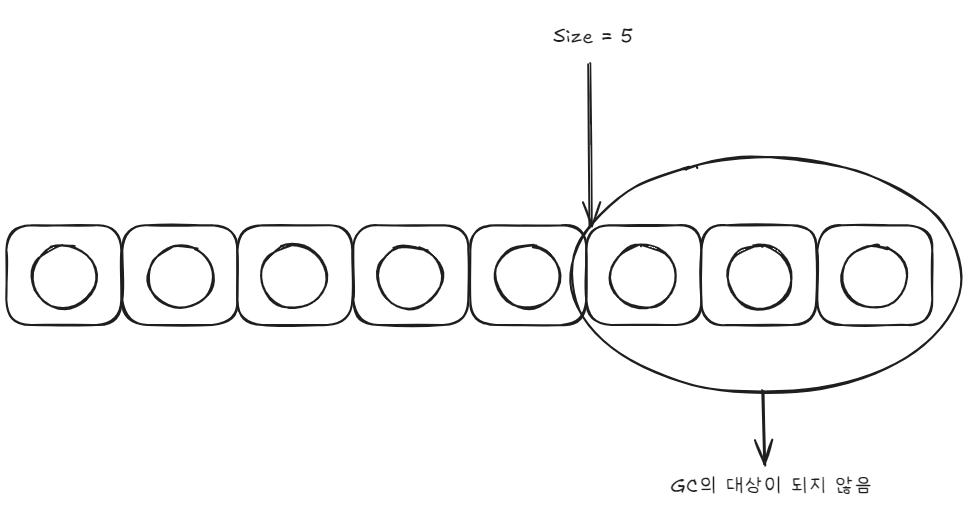

# 아이템 1. 생성자 대신 정적 팩토리 메서드를 고려하라

```java
// new 사용
Boolean b1 = new Boolean(false);

// 정적 팩토리 메소드 사용
Boolean b2 = Boolean.valueOf(false);

// ex) Boolean 내부 정적 팩토리 메서드 구현
public static Boolean valueOf(boolean b) {
	return b ? Boolean.TRUE : Boolean.FALSE;
}
```

<br>

## 정적 팩토리 메소드의 장점

### 1. **이름을 가질 수 있다.**

```java
BigInteger bigInteger = new BigInteger(int, int, Random);
BigInteger bigInteger = BigInteger.probablePrime(int, Random);
```

> 💡probablePrime ? <br>
> 주어진 bit길이에 해당하는 소수일 가능성이 매우 높은 숫자 값을 생성

new BigInteger(int, int, Random)보다는 BigInteger.probablePrime(int, Random)이 훨씬 동작을 이해하기 편하다.

<br>

### 2. **호출될 때마다 인스턴스를 새로 생성하지 않아도 된다.**

new 키워드를 사용한다면 매번 새로 생성되지만, 정적 팩토리 메소드 방식은 미리 만들어 놓거나, 캐싱하는 등 재사용이 가능하다. ex) 싱글톤

```java
Integer integer = new Integer(10);
Integer integer1 = Integer.valueOf(10);
```

위 두 방식은 차이가 없어 보인다. 하지만 위 방식은 `deprecated` 되었고, 일반적으로 아래 방식을 추천한다고 나와있다. 그 이유는 Integer에서 내부적으로 **캐싱**을 수행하기 때문이다.

자주 사용될 것으로 예상되는 -128 ~ 127의 값에 대해서는 미리 인스턴스를 만들어 놓은 후 재사용을 한다.

따라서 다음과 같은 예상치 못한 동작을 볼 수 있다.

```java
Integer valueOf1 = Integer.valueOf(127);
Integer valueOf2 = Integer.valueOf(127);
System.out.println(valueOf1 == valueOf2); // true
```

```java
Integer new1 = new Integer(127);
Integer new2 = new Integer(127);
System.out.println(new1 == new2); // false
```

-128 ~ 127에 대해 캐싱된다고 했으므로 아래와 같은 숫자는 false 가 나타난다

```java
Integer valueOf1 = Integer.valueOf(128);
Integer valueOf2 = Integer.valueOf(128);
System.out.println(valueOf1 == valueOf2); // false
```

( 캐싱 동작을 확인하기 위해 == 비교를 사용했을 뿐, Integer도 객체이기 때문에 equals를 사용해야한다.)

<br>

### 3. **반환 타입의 하위 타입 객체를 반환할 수 있는 능력이 있다.**

Collections의 emptyList와 singletonList는 둘다 List를 반환하지만 내부를 보면 각각 내부적으로 최적화된 하위 타입인 EmptyList, SingletonList를 반환하고 있다.

```java
List<Object> objects = Collections.emptyList();
List<Object> objects1 = Collections.singletonList();
```

이런 방식을 통해 사용자가 아래와 같이 하위 타입을 알아야 할 필요가 없어진다.

(예시일뿐 EmptyList는 Collections의 내부에 private static class로 존재하여 직접 생성할 수 없다.)

```java
EmptyList<Object> object = new EmptyList();
```

> 💡 Collections의 내부에는 이런 클래스가 45개나 있다. <br>
> 사용자가 이 45개의 클래스에 대해 알지 못하게 하여 프로그래밍의 난이도를 낮췄다.

<br>

### 4. **입력 매개변수에 따라 매번 다른 클래스의 객체를 반환할 수 있다.**

3번과 유사한 내용

<br>

### 5. **정적 팩토리 메서드를 작성하는 시점에는 반환할 객체의 클래스가 존재하지 않아도 된다.**

EmptyList를 사용하다가, 개선된 버전의 EmptyListV2가 나왔다고 생각해보자

new를 사용한다면 기존의 코드를 아래와 같이 수정해야 한다. (동작 코드 X)

```java
// List<Object> list = new EmptyList();
List<Object> list = new EmptyListV2();
```

정적 팩토리 메서드에서는 내부에서 아래와 같이 수정하면 사용자는 아무런 코드 변화 없이 사용할 수 있을 것이다.

```java
public static final List emptyList() {
    //return new EmptyList();
    return new EmptyListV2();
}
```

> 💡 둘 다 수정해야 하는 것 아니냐고 생각할 수도 있지만, 위의 경우 new EmptyList()를 100번 사용했다면, 100번을 수정

<br>
<br>

## 정적 팩토리 메서드 단점

### 1. 상속을 하려면 public이나 protected 생성자가 필요하니 정적 팩토리 메서드만 제공하면 하위 클래스를 만들 수 없다.

상속을 하려면 public, protected 생성자가 필요하지만 private 으로 막아두었다면, 하위 클래스를 만들 수 없다. 하지만 이는 상속보다는 컴포지션을 사용하도록 유도한다는 점에서 오히려 장점으로 받아들일 수도 있다.

[상속과 컴포지션 차이](./additional-information/상속과컴포지션차이.md)

<br>

### 2. 정적 팩토리 메서드는 프로그래머가 찾기 어렵다.

흔히 사용되는 정적 팩토리 메서드 명명 방식을 이해하여 작성하고, 사용해야 한다는 점이 존재한다.
<br>
쉽게 말해 abcdef() 이런 식으로 작성하면 찾기 어려우니 최대한 통상적으로 사용하는 명명 규칙을 사용하자는 뜻이다.

```java
Date d = Date.from();
BigInteger prime = BigInteger.valueOf();
StackWalker luke = StackWalker.getInstance();
// 등등...
```

<br>
<br>
<br>


# 아이템2. 생성자에 매개변수가 많다면 빌더를 고려하라

정적 팩토리와 생성자에는 매개변수가 많을 때 클라이언트 코드를 작성하거나 읽기 어렵다.

### 점층적 생성자 패턴

아래와 같은 `점층적 생성자 패턴`을 사용하면 매개변수가 가독성이 좋지않고, 또한 a와 c만 받는 생성자를 만들 수 없으니(a,b만 받는 생성자와 시그니처가 동일해서) 
필요없는 b를 받아야할 수도 있다. 

```java
public class NutritionFacts {
    
    private int a;
    private int b;
    private int c;

    public NutritionFacts() {
    }

    public NutritionFacts(int a) {
        this.a = a;
    }

    public NutritionFacts(int a, int b) {
        this.a = a;
        this.b = b;
    }
    
    public NutritionFacts(int a, int b, int c) {
        this.a = a;
        this.b = b;
        this.c = c;
    }
}
```

### 자바빈즈(JavaBeans) 패턴

두번째 방식으로는 `자바빈즈 패턴`을 사용할 수 있다. <br>
매개변수가 없는 생성자를 만든 후 setter를 통해 값을 설정하는 방식이다

```java
public class NutritionFacts2 {

    private int a;
    private int b;
    private int c;

    public NutritionFacts2() {
    }

    public void setA(int a) {
        this.a = a;
    }

    public void setB(int b) {
        this.b = b;
    }

    public void setC(int c) {
        this.c = c;
    }
}
```

```java
NutritionFacts2 facts = new NutritionFacts2();
facts.setA(1);
facts.setB(1);
facts.setC(1);
```
더 읽기 쉬워졌지만, 이 방식의 가장 큰 문제는 값이 세팅되기 전까지 일관성이 무너진 상태에 놓이게 된다.<br>

### 빌더 패턴
세번째 방법은 안정성과 가독성을 겸비한 빌더 패턴이다.<br>

필수 값은 Builder에서 final로 선언하여 생성할 때 받고, 각 setter와 유사한 메서드를 이용하여 값을 세팅한 뒤, 마지막에 build를 통해 생성한다.
setter들은 빌더 자신을 반환하므로 연쇄적으로 호출을 할 수 있다. <br>
이런 방식을 fluent API 혹은 method chaining이라 한다.

```java
public class NutritionFacts3 {

    private final int a;
    private final int b;
    private final int c;

    public static class Builder{
        private final int a;
        private int b;
        private int c;

        public Builder(int a){
            this.a = a;
        }

        public Builder b(int b){
            this.b = b;
            return this;
        }

        public Builder c(int c){
            this.c = c;
            return this;
        }

        public NutritionFacts3 build(){
            return new NutritionFacts3(this);
        }
    }

    private NutritionFacts3(Builder builder){
        a = builder.a;
        b = builder.b;
        c = builder.c;
    }
}
```

```java
NutritionFacts3 facts3 = new NutritionFacts3.Builder(1)
                .b(2)
                .c(3)
                .build();
```

아래와 같이 builder라는 메소드를 추가하여 new 키워드 없이 생성할 수도 있을 것 같다.
```java
public class NutritionFacts4 {

    private final int a;
    private final int b;
    private final int c;

    // 추가된 메소드
    public static Builder builder(int a){
        return new Builder(a);
    }

    public static class Builder{
        private final int a;
        private int b;
        private int c;

        public Builder(int a){
            this.a = a;
        }

        public NutritionFacts4.Builder b(int b){
            this.b = b;
            return this;
        }

        public NutritionFacts4.Builder c(int c){
            this.c = c;
            return this;
        }

        public NutritionFacts4 build(){
            return new NutritionFacts4(this);
        }
    }

    private NutritionFacts4(NutritionFacts4.Builder builder){
        a = builder.a;
        b = builder.b;
        c = builder.c;
    }
}
```

```java
NutritionFacts4 build = NutritionFacts4.builder(1)
                .b(2)
                .c(3)
                .build();
```

빌더 패턴은 계층적으로 설계된 클래스와 함께 쓰기에 좋다. <br>

```java
public abstract class Phone {

    private final int size;

    abstract static class Builder<T extends Builder<T>> {

        private int size;
        
        public T size(int size) {
            this.size = size;
            return self();
        }

        abstract Phone build();

        protected abstract T self();
    }

    Phone(Builder<?> builder){
        size = builder.size;
    }
}

public class SpeedPhone extends Phone {

    private final int speed;

    public static class Builder extends Phone.Builder<Builder> {
        
        private final int speed;

        public Builder(int speed) { this.speed = speed; }

        @Override
        SpeedPhone build() { return new SpeedPhone(this); }

        @Override
        protected Builder self() { return this; }
    }

    SpeedPhone(Builder builder) {
        super(builder);
        speed = builder.speed;
    }
}
```

```java
SpeedPhone build = new SpeedPhone.Builder(10).size(10).build();
```

### 빌더 패턴의 단점
- 객체를 만들기 위해 빌더부터 만들어야 한다. 생성 비용이 크지는 않지만 성능에 민감한 상황에서는 문제가 될 수 있다.
- 또한 코드가 장황해진다는 단점이 존재한다.

<br>
<br>

# 아이템 3. private 생성자나 열거 타입으로 싱글톤임을 보증하라

싱글톤이란 인스턴스를 오직 하나만 생성할 수 있는 클래스를 말한다. <br>
클래스를 싱글톤으로 만들면 이를 사용하는 클라이언트를 테스트하가 어려워질 수 있다. <br>
타입을 인터페이스로 정의한 다음 그 인터페이스를 구현해서 만든 싱글톤이 아니라면 싱글톤 인스턴스를 mock으로 대체할 수 없기 때문이다.

### public static final 필드 방식
private 생성자를 통해 초기화할 때 딱 한 번만 호출되도록 보장할 수 있다. <br>
하지만 리플렉션 API를 사용해 private 생성자를 호출할 수 있다. <br>
장점 
- 해당 클래스가 싱글톤임이 API에 잘 드러난다.
- 간결함
```java
public class Singleton1 {
    public static final Singleton1 INSTANCE = new Singleton1();
    private Singleton1() {}
    public void doSomeThing(){}
}
```

### 정적 팩토리 방식
장점
- 추후에 API를 바꾸지 않고도 싱글톤이 아니게 변경할 수 있다.
- 정적 팩토리를 제네릭 싱글톤 팩토리라 만들 수 있다. (아이템 30 참고)
- 정적 팩토리의 메소드 참조를 공급자로 사용할 수 있다. (Singletos2::getInstance를 Supplier<Singleton2>로 사용)
```java
public class Singleton2 {
    private static Singleton2 instance = new Singleton2();
    private Singleton2() {}
    public static Singleton2 getInstance() {
        return instance;
    }
    public void doSomeThing(){}
}
```

두 방식 모두 직렬화하기 위해서 단순히 Serializable 을 구현한다고 선언하는 것만으로는 부족하다. <br>
모든 인스턴스 필드를 일시적(transient)이라고 선언하고 readResolve 메서드를 제공해야 한다.(아이템 89) <br>
이렇게 하지 않으면 직렬화된 인스턴스를 역직렬화할 때마다 새로운 인스턴스가 만들어진다.


> serialVersionUID 란? <br>
private static final long serialVersionUID = 1L; 과 같은 식으로 클래스 내부에 선언된 걸 볼 수 있다. <br>
이는 직렬화/역직렬화 시 똑같은 클래스더라도 변경이 있으면 호환이 되지 않을 수 있기 때문에 버전을 지정하기 위해 사용하는 것이다. <br>


단순 Serializable 을 구현한 싱글톤 클래스
```java
public class Singleton implements Serializable {
    // 싱글턴 인스턴스
    private static final Singleton INSTANCE = new Singleton();

    // private 생성자
    private Singleton() {}

    public static Singleton getInstance() {
        return INSTANCE;
    }
}
```
직렬화 - 역직렬화 실행 결과
```java
// 싱글턴 인스턴스 가져오기
Singleton singleton = Singleton.getInstance();

// 직렬화: 객체를 파일에 저장
ObjectOutputStream out = new ObjectOutputStream(new FileOutputStream("singleton.ser"));
out.writeObject(singleton);
out.close();

// 역직렬화: 파일에서 객체 복원
ObjectInputStream in = new ObjectInputStream(new FileInputStream("singleton.ser"));
Singleton deserializedSingleton = (Singleton) in.readObject();
in.close();

// 인스턴스 동일성 확인
System.out.println("원본 객체: " + singleton); // 원본 객체: chapter2.item3.serializable.Singleton@6438a396
System.out.println("직렬화/역직렬화 객체: " + deserializedSingleton); // 직렬화/역직렬화 객체: chapter2.item3.serializable.Singleton@61e717c2
System.out.println("같은지 비교 : " + (singleton == deserializedSingleton)); // 같은지 비교 : false
```

readResolve 메서드를 작성한 싱글톤
```java
public class Singleton implements Serializable {
    // 싱글턴 인스턴스
    private static final Singleton INSTANCE = new Singleton();
    // private 생성자
    private Singleton() {}
    public static Singleton getInstance() {
        return INSTANCE;
    }

    // readResolve 메서드로 역직렬화 시 원래 인스턴스 반환
    private Object readResolve() throws ObjectStreamException {
        return INSTANCE;
    }
}
```
직렬화 - 역직렬화 실행 결과
```java
System.out.println("원본 객체: " + singleton); // 원본 객체: chapter2.item3.serializable.Singleton@6438a396
System.out.println("직렬화/역직렬화 객체: " + deserializedSingleton); // 직렬화/역직렬화 객체: chapter2.item3.serializable.Singleton@6438a396
System.out.println("같은지 비교 : " + (singleton == deserializedSingleton)); // 같은지 비교 : true
```


### 원소가 하나인 열거 타입 선언 방식
추가 노력 없이 직렬화가 가능하고, 리플렉션 공격에서도 새로운 인스턴스가 생기는 일을 막아준다. 대부분 상황에서는 이 방식이 가장 좋지만, Enum외의 클래스를 상속해야 한다면 사용할 수 없다
```java
public enum Singleton3 {
    INSTANCE;
    
    public void doSomeThing(){}
}
```

<br>
<br>
<br>

# 아이템 4. 인스턴스화를 막으려거든 private 생성자를 사용하라
의도치 않게 인스턴스화 할 수 있게 된 클래스가 있다. 추상 클래스로 만들더라도 하위 클래스를 만들어 인스턴스화 할 수 있기 때문이다. <br>
이를 본 사용자는 상속해서 쓰라는 뜻으로 오해할 수 있으니, 명시적으로 private 생성자를 추가하여 클래스의 인스턴스화를 막을 수 있다.

```java
private MyClass(){
    throw new AssertionError();
}
```
AssertionError 반드시 던질 필요는 클래스 내에서 호출하지 않도록 해준다.

<br>
<br>
<br>

# 아이템 5. 자원을 직접 명시하지 말고 의존 객체 주입을 사용하라
의존성을 가진 클래스를 `정적 유틸리티 클래스`나 `싱글톤`으로 구현하는 경우가 있다. <br>

### 정적 유틸리티 클래스
> 정적 유틸리티 클래스는 정적 메소드나 정적 필드만을 포함하여 인스턴스를 생성하지 않고 사용할 수 있는 클래스를 말한다.
```java
public class StaticUtilityClass {
    private static final Dictionary dictionary = new Hashtable();

    private static boolean isValid(String word){
        // .. do something
    }
}
```
### 사용 예시
```java
StaticUtilityClass.isValid("Hello");
```

### 싱글톤 클래스 
```java
public class SingletonClass {
    private static final SingletonClass INSTANCE = new SingletonClass();

    private SingletonClass() {}

    public static SingletonClass getInstance() {
        return INSTANCE;
    }

    private final Dictionary dictionary = new Hashtable();

    public boolean isValid(String word){
        return false;
    }
}
```

두 방식에서 만약 사전이 언어별로 존재하거나, 테스트용 사전을 사용하고 싶을 땐 어떻게 할까? <br>
final을 제거하고 사전을 변경하는 setter를 작성할 수 있겠지만, 이 방식은 오류를 내기 쉽고 멀티스레드 환경에서 사용할 수 없다. <br>
> (예를들면) 사전을 null로 변경하고 바꾸고 싶은 사전을 넣는 동작에서 다른 스레드가 사용한다면 NullPointException을 발생시킬 수 있다. <br>
> 정적 유틸리티 클래스와 싱글톤의 장점(특징) 중 하나인 Thread-safe를 만족시킬 수 없어지게 된다. <br>

의존 관계를 가지는 클래스는 정적 유틸리티, 싱글톤 클래스보다 의존관계 주입을 사용하자.

<br>
<br>
<br>

# 아이템 6. 불필요한 객체 생성을 피하라

### String은 리터럴 방식으로 생성하자

```java
String s = new String("Hello!");
```
> 위 방식은 실행될 때마다 String 인스턴스를 새로 만든다.

```java
String s = "Hello!";
```
> 위 방식은 하나의 String 인스턴스를 재사용한다. 또한 똑같은 문자열 리터럴을 사용하는 코드가 같은 객체를 사용함이 보장된다. <br>
> 참고 : https://eastplanet.tistory.com/229 

### 팩토리 메서드
```java
Boolean b1 = new Boolean(false);
Boolean b2 = Boolean.valueOf(false);
```
> 위 경우에서 아래 방식을 사용하면, 생성한 객체를 재활용할 수 있다.

### 오토 박싱
```java
Long sum = 0L;
for (long i = 0; i <= Integer.MAX_VALUE; i++){
    sum += i;
}
return sum;
```
위와 같은 방식에서 long을 Long으로 오토박싱하는 과정에서 오랜 시간이 걸리게 된다. <br>
하지만 "객체 생성을 피해야 한다"라고 오해하면 안된다. <br>
작은 객체를 생성/회수하는 비용은 크지 않으므로, 프로그램의 명확성, 간결성, 기능을 위해서 객체를 생성하는 것은 좋은 일이다. <br>
또한 아주 무거은 객체(DB 커넥션)이 아니고서야 객체 풀을 직접 만들지는 말아야 한다. <br>
코드가 이해하기 어려워지고, 오히려 성능을 떨어뜨릴수 있다.

<br>
<br>
<br>

# 아이템 7. 다 쓴 객체 참조를 해제하라

```java
public class Stack {
    private Object[] elements;
    private int size = 0;
    private static final int DEFAULT_INITIAL_CAPACITY = 16;

    public Stack() {
        elements = new Object[DEFAULT_INITIAL_CAPACITY];
    }

    public void push(Object element) {
        ensureCapacity();
        elements[size++] = element;
    }

    public Object pop() {
        if (size == 0) {
            throw new EmptyStackException();
        }
        return elements[--size];
    }

    private void ensureCapacity() {
        if (size == elements.length) {
            elements = Arrays.copyOf(elements, size * 2 + 1);
        }
    }
}
```
위 코드는 문제가 없어 보이지만, size가 줄어든 이후 사용되지 않는 객체들이 GC의 대상이 되지 않는 문제가 있다. <br>
이를 방지하기 위해서는 pop시 elements[size] = null; 을 해주어야 한다.



<br>
<br>
<br>

# 아이템 8. finalizer 와 cleaner 사용을 피하라

finalizer는 예측할 수 없고, 상황에 따라 위험할 수 있기 때문에 일반적으로 불필요하다. <br>
cleaner는 finalizer보다는 덜 위험하지만, 여전히 예측할 수 없고, 일반적으로 불필요하다. <br>
객체에 접근을 할 수 없게 된 후 finalizer와 cleaner가 실행되기까지 얼마나 걸릴지 알 수 없다. <br>
파일 닫기를 finalizer, cleaner에 맡기면 중대한 오류를 일으킬 수도 있다. <br>
상태를 영구적으로 수정하는 작업에서는 절대 finalizer나 cleaner에 의존해서는 안된다. (데이터베이스의 락 해제를 finalizer에서 처리) <br>
다음과 같은 추가로 존재한다.
- finalizer 동작 중 발생한 예외는 무시되기 때문에 제대로 삭제되지 못할 수 있다.
- finalizer 를 사용한 클래스는 finalizer 공격에 노출되어 보안 문제를 일으킬 수도 있다.
- finalizer를 사용하면 성능 문제를 일으킬 수 있다. (try-with-resources에 비해 50배 가량 느림)

### 대체 방법
AutoCloseable을 구현해주고, 인스턴스를 다 쓰고난 뒤 close를 호출하면 된다.

<br>
<br>
<br>

# 아이템 9. try-finally보다는 try-with-resources를 사용하라

자바 라이브러리에는 close를 호출해서 직접 닫아줘야 하는 자원이 많다. <br>
finalizer를 통해 자원 닫기를 놓쳤을 때 안전망을 구성하기도 하지만, 그리 믿을만 하지 못하다. <br>
따라서 전통적으로 try-finally가 사용되었다.


