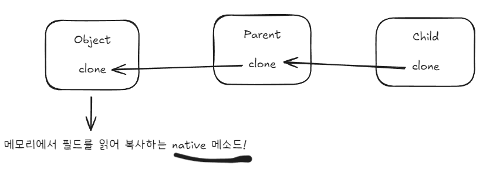
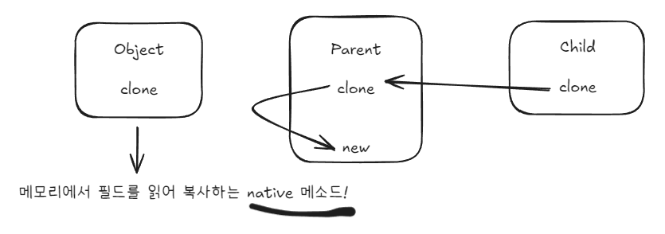
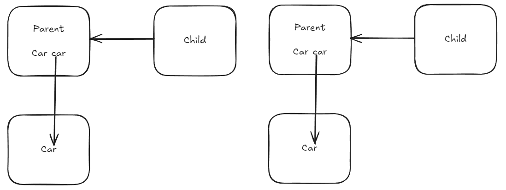
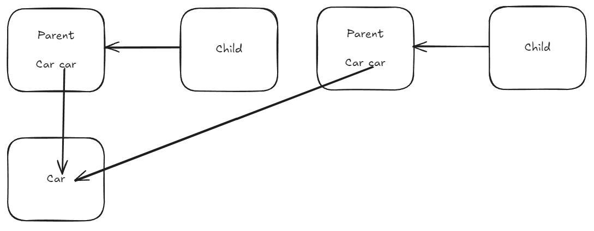

# 3장 모든 객체의 공통 메서드
Object는 기본적으로 상속해서 사용하도록 설계되었다. <br>
Object에서 final이 아닌 메서드 (equals, hashCode, toString, clone, finalize)는 모두 재정의를 염두에 두고 설계된 것이다. <br>
따라서 일반 규약에 맞게 재정의해야 한다. <br>
메서드를 잘못 구현하면 이 규약을 준수한다고 가정하는 클래스(HashMap과 HashSet 등)를 오동작하게 만들 수 있다. <br>

<br>
<br>
<br>

# 아이템 10. equals는 일반 규약을 지켜 재정의하라
equals는 재정의하기 쉬워 보이지만 함정이 많이 도사리고 있다. <br>
가장 좋은 방법은 재정의를 하지 않는 것이다. <br>
그냥 두면 자기 자신과만 같게 된다. (주소가 같으므로) <br>

### 재정의하지 않아도 되는 상황
- 각 인스턴스가 본질적으로 고유하다.
  - 값을 표현하는 게 아니라, 동작하는 개체를 표현하는 클래스가 여기 해당.
  - Thread 등이 있다.
- 인스턴스의 논리적 동치성을 검사할 일이 없다.
  - ex) Person의 Id가 같으면 똑같은 객체라고 판단하고 싶다
- 상위 클래스에서 재정의한 equals를 그대로 사용할 수 있다.
- 클래스가 private이거나 package-private이고 equals를 호출할 일이 없다.
  - equals를 실수로라도 호출되는 것을 막고 싶다면, equals에서 Exception을 던지도록 재정의하자

### 재정의가 필요한 상황
- 논리적 동치성을 확인해야 하는데, 상위 클래스의 equals에서 이를 비교할 수 있게 재정의되지 않은 경우
  - 주로 값 클래스가 이에 해당한다. String, Integer 등
  - equals가 논리적 동치성을 확인하도록 재정의하면 Map, Set의 원소로 사용할 수 있게 된다.

### equals 메서드를 재정의할 때는 반드시 일반 규약을 따라야 한다.
- 반사성(reflexivity) : null이 아닌 모든 참조 값 x에 대해, x.equals(x)는 true다.
- 대칭성(symmetry) : null이 아닌 모든 참조 값 x, y에 대해, x.equals(y)가 true면 y.equals(x)도 true다.
- 추이성(transitivity) : null이 아닌 모든 참조 값 x, y, z에 대해, x.equals(y)가 true이고 y.equals(z)도 true면 x.equals(z)도 true다.
- 일관성(consistency) : null이 아닌 모든 참조 값 x, y에 대해, x.equals(y)를 반복해서 호출하면 항상 true를 반환하거나 항상 false를 반환한다.
- null아님 : null이 아닌 모든 참조값 x에 대해 x.equals(null)은 false다.

필드 비교 시 float, double을 제외한 기본 타입 필드는 == 연산자로 비교하고, 참조 타입 필드는 equals 페서드로, float과 double은 Float.compare(), Double.compare()로 비교한다. <br>
float과 double을 따로 비교하는 이유는 Float.NaN, -0.0f, 특수한 부동소수 값 등을 다뤄야 하기 때문이다. <br>
null도 정상 값으로 취급하는 필드의 경우 Objects.equals()로 비교하여 NullPointException을 예방하자. <br>

### 주의사항
- equals를 재정의할 땐 hashcode도 반드시 재정의하자
- 너무 복잡하게 해결하려 들지 말자 (필드들의 동치성만 검사해도 equals 규약을 어렵지 않게 지킬 수 있다.)
- Object가 아닌 타입을 매개변수로 받는 public boolean equals(MyClass o)와 같은 메서드는 오버 라이딩이 아닌 오버 로딩이다! 이렇게 정의하지 말아야 한다!

<br>
<br>
<br>

# 아이템 11. equals를 재정의하려거든 hashcode도 재정의하라

### Object 명세에서 발췌한 관련 규약
- equals 비교에 사용되는 정보가 변경되지 않았다면, hashcode는 몇번을 호출해도 항상 같은 값을 반환해야 한다.
- equals 가 두 객체를 같다고 판단하면, 두 객체의 hashCode는 똑같은 값을 반환해야 한다.
- equals가 두 객체를 다르다고 판단해도, 두 객체의 hashCode가 다른 값을 반환할 필요는 없다.

```java
@Override
public int hashCode() {
    return 3;
}
```
위와 같은 코드는 적법하지만, 해시를 사용하는 자료구조에서 매우 낮은 성능을 가져온다.

<br>
<br>
<br>

# 아이템 12. toString을 항상 재정의하라
toString을 잘 구현한 클래스는 디버깅이 쉽다. <br>
toString은 그 객체가 가진 주요 정보 모두를 반환하는 게 좋다. <br>
또한 toString에 명세를 작성하는 것이 좋다. 추후 외부에서 이를 이용하여 파싱을 할 수도 있기 때문이다. <br>
상세히 toString의 생성 규칙을 작성하던가 혹은 변경의 유연성을 주기 위해 향후 변경될 수 있다고 적어야 한다. <br>
toString에 포함된 필드는 getter를 제공하자, getter 없이 toString만 준다면 사실상 이를 이용하여 파싱을 하라는 것이다. <br>
향후 toString 포맷을 바꾸면 시스템이 망가지는 결과를 초래할 수 있다. 

# 아이템 13. clone 재정의는 주의해서 진행하라
Cloneable은 아무 메서드도 정의하지 않고, 단순히 복제가 가능하다는 **의미만 전달**한다. <br>
Object의 clone은 protected이기 때문에 외부에서 clone을 호출할 수 없다. 따라서 실무에서는 public으로 접근 제한자를 확장하여 재정의를 한다. <br>
clone이 정확하게 동작하기 위해서는 1. 그 클래스와 모든 상위 클래스가 허술하며 복잡하며 강제할수도 없이 기술된 프로토콜을 지켜야만 한다. <br>
그 결과 매우 깨지기 쉽고, 위험한 메커니즘이 탄생한다.

### clone 메서드의 규약은 허술하다.

어떤 x에 대해 다음 식은 참이다.
```java
x.clone() != x
```
다음 식도 참이다
```java
x.clone().getClass() == x.getClass()
```
다음 식은 일반적으로 참이지만, 필수는 아니다.
```java
x.clone().equals(x)
```
관례상, 이 clone이 반환하는 객체는 super.clone을 호출해 얻어야 한다. <br>
이 클래스와 모든 상위 클래스가 이 관례를 따른다면 다음 식은 참이다.
```java
x.clone().getClass() == x.getClass()
```
관례상, 반환된 객체와 원본 객체는 독립적이어야 한다. 이를 만족하려면 super.clone으로 얻은 객체의 필드 중 하나 이상을 반환 전에 수정해야 할 수도 있다.

> Object.clone() 동작 방식 <br>
> 해당 메서드는 native로 C/C++ 코드로 구현된다. (JVM 내부) <br>
> 메모리에서 해당 객체의 모든 필드를 비트 단위로 복사한다. (얕은 복사) <br>

### 잘못된 clone 구현이 상위 부모 중 하나라도 있다면.. 



위와 같이 super.clone을 잘 부르면 된다.

<br>
<br>




super.clone을 부르는게 아니라 그냥 new로 만들어서 줘버린다면? <br>
부모가 자식의 필드를 못보는 등의 여러 제약사항을 전부 뛰어 넘는 JVM에서의 메모리의 비트를 읽어 복사를 하는 강력한(원래의) 기능이 사라진다. <br>

### 얕은 복사

클래스에 정의된 모든 필드가 기본 타입이고, 불변 객체를 참조한다면 정상적으로 동작한다. <br>
하지만 가변 객체를 참조하는 순간 문제가 발생한다. <br>



위와 같이 복사되기를 기대하지만, 실제로는 얕은 복사가 되어 아래와 같이 복사가 된다.



아래와 같이 car에 대해서도 재귀적으로 clone을 호출하는 방식으로 해결할 수 있다.

```java
@Override
protected Parent clone() throws CloneNotSupportedException {
  Parent clone = (Parent) super.clone();
  clone.car = car.clone();
  return clone;
}
```

### 정리
- Cloneable을 구현하는 모든 클래스는 clone을 재정의해야 한다.
- 접근 제한자는 public
- 반환 타입은 자신 클래스
- super.clone을 호출한 후 (깊은 복사가 필요하다면) 필드를 적절히 수정한다.

복사 생성자, 복사 팩터리 방식이 Cloneable/clone 방식보다 나은 면이 많다.

### 복사 생성자
자신과 같은 클래스의 인스턴스를 인수로 받는 생성자를 말한다.

```java
public MyClass(MyClass myClass) { ... };
```

### 복사 팩터리
복사 생성자를 모방한 정적 팩터리다.

```java
public static MyClass newInstance(MyClass myClass) { ... } ;
```

위와 같은 방식은 MyClass에 인터페이스가 올 수 있다. <br>
HashSet 객체 s를 TreeSet으로 복제하기 위해 간단히 new TreeSet<>(s); 가 가능해진다.